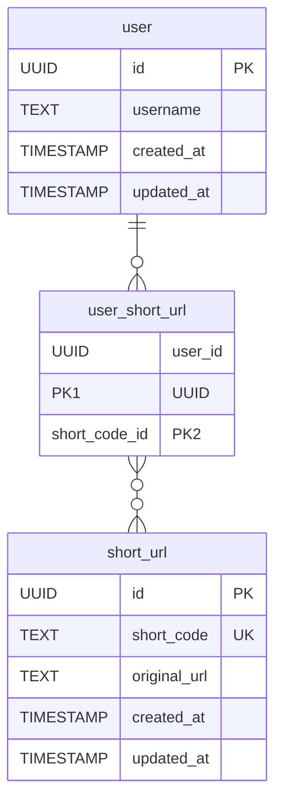
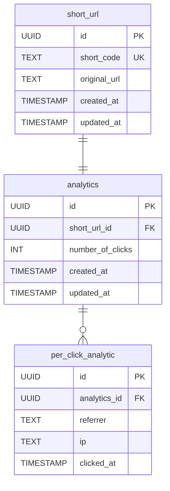
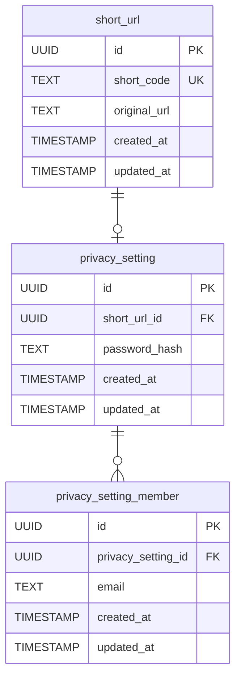
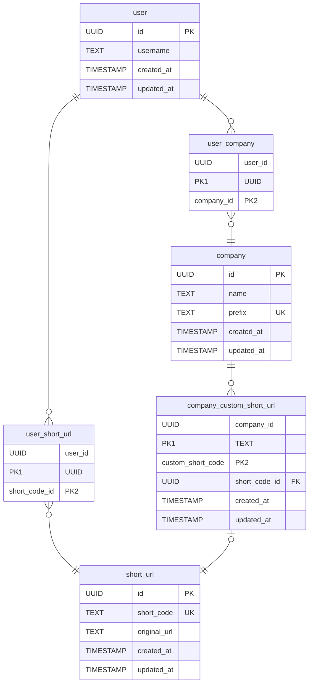
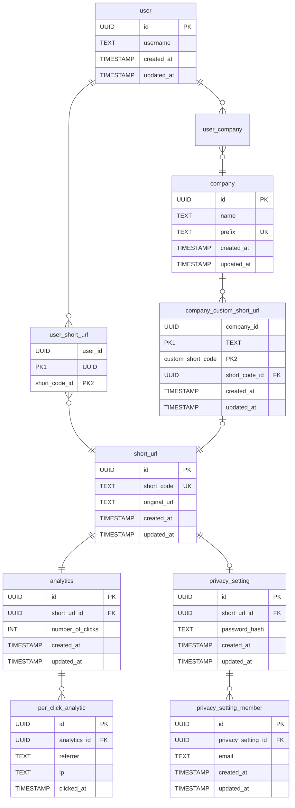

# URL Shortener

This is an URL shortener app for a technical interview @ Stoïk.

## How to use this app

- Create a `.env` file in `front/` and `back/` based on the `.env.dist` files
- In a terminal run the command `make start`

You can then access the frontend on the URL that you have given it. The base local URL is : http://localhost:3001

### Bonus

You can activate the Google Safe Browsing API by setting up a Google Cloud project and activating the GSB API.

You also have to generate an API key and in the `back/` folder `.env` you should set the value of :
- `GOOGLE_SAFE_BROWSING_API_KEY` to your API key value.
- `ACTIVATE_GOOGLE_SAFE_BROWSING` to `true` to activate it.

## Technical choices :

### Backend:
- Usage of NestJS and TypeScript because of the ease of use. NestJS provides a good structure and it is a framework I've already used in the past.
- Usage of the library `nanoid` to create the short codes for the links. The library uses these symbols to form an ID : `A-Za-z0-9_-`. With a length of 7, a collision has a tiny chance of happening because there are `(26 + 26 + 10 + 2)^7 = 4 398 046 511 104` possibilities. With 1000 URLs generated per second it would take 140 years to encounter all possibilities, so I think we are pretty safe (for now... let's talk about it in 140 years).
- Usage of Google Safe Browsing (GSB) API. Since people may use a link shortener to hide their unsafe domain, I decided to use an API that checked whether a domain was blacklisted or not. I debated using either GSB or something called URLhaus, that has a huge database containing thousands of blacklisted domains. GSB is pretty simple to use and free of charge as long as we are not using it in a commercial way.
    - In the case of this technical assessment I decided to feature flag it and set it as disabled by default. But if you wish to see it work, simply create an API key that has the rights to use the GSB API.

As for the database and the interaction between the API and itself:
- PostgreSQL because it's a solid default for relational data and pairs well with Prisma.
- I chose the Prisma ORM, because I'm already familiar with it. Some alternatives exist such as Drizzle and many more.
- The data layer uses a repository pattern: services depend on an `IShortUrlRepository` interface injected via a Symbol token, not on Prisma directly. This makes it easy to swap the implementation or to unit test services without hitting the database.
- Short codes in the `short_url` table have a unique constraint at the database level. If a `nanoid` collision ever happened, the DB would reject the insert rather than silently creating a duplicate.

### Frontend

- I chose React with Bun as the runtime. Bun replaces the entire Node + Vite + Express stack with a single tool: it serves, bundles, handles HMR in dev, and acts as the package manager. No extra build tooling needed. DX wise, it felt like a good fit for a project of this scope.
- Shadcn and Tailwind for the UI. Shadcn gives me primitives with full control over styling and behavior, unlike opinionated design systems that can be hard to customize.

## Next steps

### Product
- User login. Adding a login feature may be useful, some users may want to easily retrieve their past links and manage them (delete, set behin a password, check analytics...)

- Analyze clicks. We could imagine a new table and a new NestJS module tracking the number of times the short code has been accessed.

- Another evolution can be to store per clicks data. In a new table we could store the timestamp, the referrer, IP etc.

- Privacy mode. The shortened URLs can be accessed by anyone as long as they know the short code. The short codes having a length of 7, can sometimes be guessed. A new feature could be to hide the access behind a password, or maybe authorize the access by a list of emails.

- Custom short URLs and prefixes. If for example a company wants to track if a promotional campaign has some success it can track it via the analytics feature and to avoid customers being suspicious of a link with a generated short code, a feature could add custom URLs with custom prefixes.
	- The custom prefix will allow multiple users to have the same custom short code
	- Example `/company-name/MY-SUPER-PROMO-LINK`

If all features were implemented :

### Security
- Rate limiting
- Input sanitization
- Report suspicious links

### Scalability
- Caching short codes. We can think of adding a Redis cache, to store shortened URLs on first access. We can add a TTL of an hour.
- Master / replica - Write to the master DB, a copy is made to the replica, we read data from the replica.
- Horizontal scaling of the API. We can think of adding some horizontal scaling via a cloud provider or kubernetes to avoid downtime when the app is flooded.
- Archive links that are not accessed for a year. Archive old URLs (cold storage), to offer more space and avoid the vertical scaling of the DB which can be expensive (more disk, more CPU, more RAM)

## Note about using AI

I used Cursor to speed up the dev process, most notably to create a nice UI.

I gave the AI instructions and reviewed the code. I made sure all committed changes were checked and updated when needed.